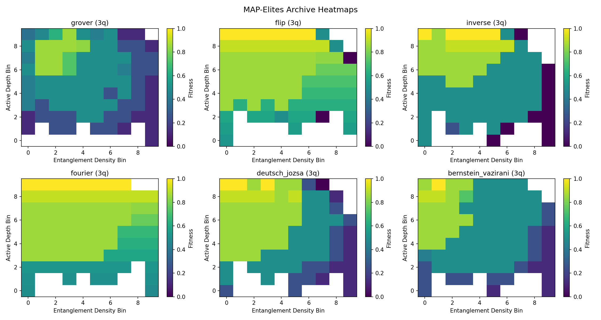

# Multi-Objective and Quality-Diversity Optimization of Quantum Circuits

**Automatically discovers quantum algorithms using evolutionary optimization, multi-objective search, and quality-diversity methods -- among the first applications of MAP-Elites to quantum circuit design.**

This project benchmarks **6 optimization methods** across **6 quantum problems** (360 experiments), comparing evolutionary algorithms, deep learning (REINFORCE), gradient-based optimization, multi-objective search (NSGA-II), and quality-diversity (MAP-Elites). A custom pure-numpy statevector simulator provides 100--1000x faster evaluation than Qiskit-based alternatives, enabling large-scale experimentation on a single machine.

> **Paper:** [paper/paper.pdf](paper/paper.pdf) -- *Multi-Objective and Quality-Diversity Optimization of Quantum Circuits via Statevector Simulation*
>
> **Literature Review:** [literature_review/literature_review.pdf](literature_review/literature_review.pdf) -- Survey of 35+ papers across 8 sub-fields

---

## Key Results

**3 qubits, 10,000 evaluations, 10 trials per condition.**

| Problem | RS | EA | Gradient | DL | NSGA-II | MAP-Elites |
|---------|:--:|:--:|:--------:|:--:|:-------:|:----------:|
| Grover | 0.83 | **0.97** | 0.00 | 0.94 | 0.77 | 0.89 |
| Flip | 0.75 | 0.50 | 0.05 | **0.99** | 0.54 | 0.72 |
| Inverse | 0.88 | 0.67 | 0.30 | **1.00** | 0.65 | **1.00** |
| Fourier | **1.00** | **1.00** | 0.52 | **1.00** | 0.99 | **1.00** |
| Deutsch-Jozsa | 0.93 | 0.95 | 0.13 | **1.00** | 0.80 | 0.98 |
| Bernstein-Vazirani | 0.91 | 0.72 | 0.00 | 0.98 | 0.69 | **0.99** |


### Key Findings

1. **REINFORCE achieves the highest fitness** on most problems, reaching perfect 1.00 on Inverse, Fourier, and Deutsch-Jozsa.
2. **MAP-Elites matches or exceeds single-objective methods** on 3 of 6 problems while simultaneously discovering diverse circuit families (79--87% archive coverage). This is among the first demonstrations of quality-diversity optimization for quantum circuit design.
3. **NSGA-II produces the most compact circuits** (2.6--11.1 non-identity gates vs 14--22 for other methods), revealing fidelity-complexity trade-offs via Pareto fronts.
4. **Gradient-based optimization consistently fails** for discrete quantum circuit synthesis, due to the discretization gap between soft gate mixtures and hard gate selections.
5. **The EA is 3--10x faster** than other methods by wall-clock time but gets trapped in local optima on harder problems.

### Quality-Diversity (MAP-Elites)

MAP-Elites maintains a 2D archive indexed by circuit depth and entanglement density, illuminating the landscape of viable circuits for each problem:

| Problem | Archive Coverage | QD-Score | Best Fitness |
|---------|:----------------:|:--------:|:------------:|
| Grover | 87% | 36.5 | 0.85 |
| Flip | 79% | 60.1 | 1.00 |
| Inverse | 83% | 46.0 | 1.00 |
| Fourier | 84% | 65.5 | 1.00 |
| Deutsch-Jozsa | 84% | 48.9 | 1.00 |
| Bernstein-Vazirani | 86% | 43.9 | 1.00 |




---

## Why This Matters

- **Novel contribution**: One of the first applications of MAP-Elites quality-diversity optimization to quantum circuit discovery. Prior work (Zorn et al., 2025) applied CMA-MAE to variational circuits for combinatorial optimization; this project applies MAP-Elites to algorithmic circuit synthesis (Grover, QFT, Deutsch-Jozsa, Bernstein-Vazirani).
- **Comprehensive comparison**: Six fundamentally different optimization paradigms compared head-to-head on the same problems with the same evaluation budget -- EA, random search, gradient, deep learning, multi-objective, and quality-diversity.
- **Fast simulation**: Pure numpy statevector simulator (~microseconds per evaluation) enables 100--1000x more evaluations than Qiskit-based competitors, making large-scale studies tractable on commodity hardware.
- **Reproducible**: Deterministic seeds, configurable trial counts, and automated study scripts. All results regenerable with a single command.

---

## Optimizers

| Method | Type | Approach |
|--------|------|----------|
| **Evolutionary Algorithm** | Single-objective | DEAP-based EA with two-point crossover and bit-flip mutation |
| **Random Search** | Baseline | Uniform random circuit generation |
| **Gradient-Based** | Single-objective | Continuous relaxation with softmax weighting, L-BFGS-B |
| **Deep Learning** | Single-objective | REINFORCE policy gradient with feedforward network |
| **NSGA-II** | Multi-objective | Pareto-front selection on (fidelity, depth, gate count) |
| **MAP-Elites** | Quality-diversity | 2D archive indexed by (active depth, entanglement density) |

## Problems

| Problem | Target | Classical Complexity |
|---------|--------|---------------------|
| Grover's Search | P(marked\_item) = 1.0 | O(N) linear search |
| Flip | Bitwise NOT | O(N) direct |
| Inverse | 1/x | O(N) direct |
| Fourier | QFT | O(N log N) |
| Deutsch-Jozsa | P(\|0...0>) = 0 for balanced function | O(N/2+1) queries |
| Bernstein-Vazirani | P(\|s>) = 1.0 for hidden string s | O(N) queries |

---

## How It Works

Quantum circuits are represented as integer matrices where each cell encodes a gate type:

| Symbol | Gate |
|--------|------|
| `T` | T gate |
| `H` | Hadamard gate |
| `. - (+)` | CNOT (control above target) |
| `(+) - .` | CNOT (target above control) |
| `\|` | Identity (no-op) |

Fitness is the probability of measuring the correct target state from the circuit output. Optimizers evolve these gate arrays to maximize fitness (and optionally minimize depth/complexity).

---

## Getting Started

### Installation

```bash
python -m venv venv
source venv/bin/activate
pip install -r requirements.txt
```

For the comparative study (requires PyTorch and matplotlib):

```bash
pip install -r requirements-study.txt
```

### Quick Start

```bash
# Evolve a Grover's search circuit
python -m examples.grover_demonstration

# Run the full 6-optimizer comparative study
python -m examples.run_qd_study

# Full study with scaling analysis (2-5 qubits, 25K budget, 20 trials)
python -m examples.run_qd_study --full
```

Results are saved to `study_results/qd_study/` including JSON data and PNG charts.

### Tests

```bash
pytest
```

---

## Project Structure

```
quantum_ea/                        # Main package
    gates.py                       # GateType enum, CNOT handling, redundancy removal
    circuit.py                     # Pure numpy statevector simulation
    fitness.py                     # Fitness evaluation with caching
    visualization.py               # ASCII circuit output
    evolutionary_algorithm.py      # DEAP EA with injectable evaluation
    config.py                      # Typed EAConfig from config.ini
    target_generation.py           # Problem target state generation
    optimizers/                    # All 6 optimizer implementations
        base.py                    # OptimizerBase ABC + OptimizationResult
        ea_optimizer.py            # Evolutionary algorithm
        random_search.py           # Random search baseline
        gradient_optimizer.py      # Continuous relaxation + L-BFGS-B
        dl_optimizer.py            # REINFORCE policy gradient
        nsga2_optimizer.py         # NSGA-II multi-objective
        mapelites_optimizer.py     # MAP-Elites quality-diversity
    problems/                      # 6 benchmark problem definitions
    classical/                     # Classical algorithm baselines
    study/                         # Experiment runner, metrics, plotting
examples/                          # Entry points and demonstrations
tests/                             # pytest test suite
paper/                             # Research paper (LaTeX + PDF)
literature_review/                 # Literature review (LaTeX + PDF)
study_results/                     # Generated results and charts
```

## Configuration

EA hyperparameters are configured in `config.ini`:

```ini
[EvolutionaryAlgorithm]
INDIVIDUAL_DNA_SIZE = 30
INDIVIDUAL_SWAP_PROBABILITY = 0.1
TOURNAMENT_SIZE = 3
POPULATION = 100
BREEDING_PROBABILITY = 0.5
MUTATION_PROBABILITY = 0.2
GENERATIONS = 200
```

---

## Citation

If you use this software, its results, or algorithms in a publication or official document, you are **required** to cite the original work (see [NOTICE](NOTICE) and [CITATION.cff](CITATION.cff)):

```
Snell, T. (2026). Multi-Objective and Quality-Diversity Optimization
of Quantum Circuits via Statevector Simulation. Quantum Computing
Evolutionary Algorithm Design.
```

## License

This project is licensed under the GNU General Public License v3.0 with an additional academic citation requirement under Section 7(b). See [LICENSE](LICENSE), [NOTICE](NOTICE), and [CITATION.cff](CITATION.cff) for details.
